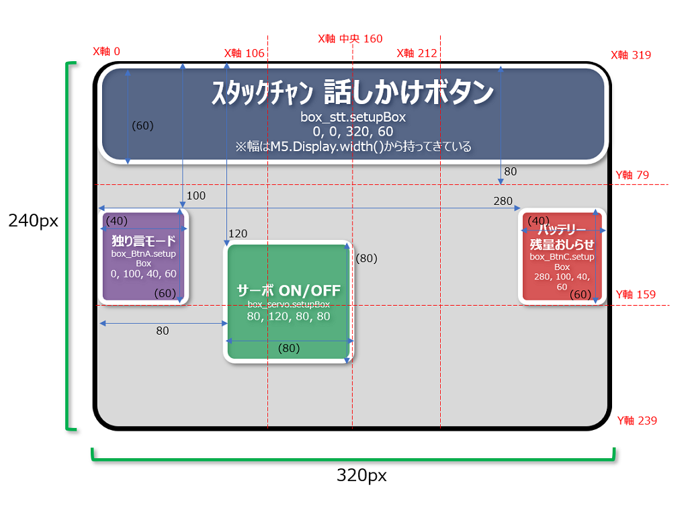
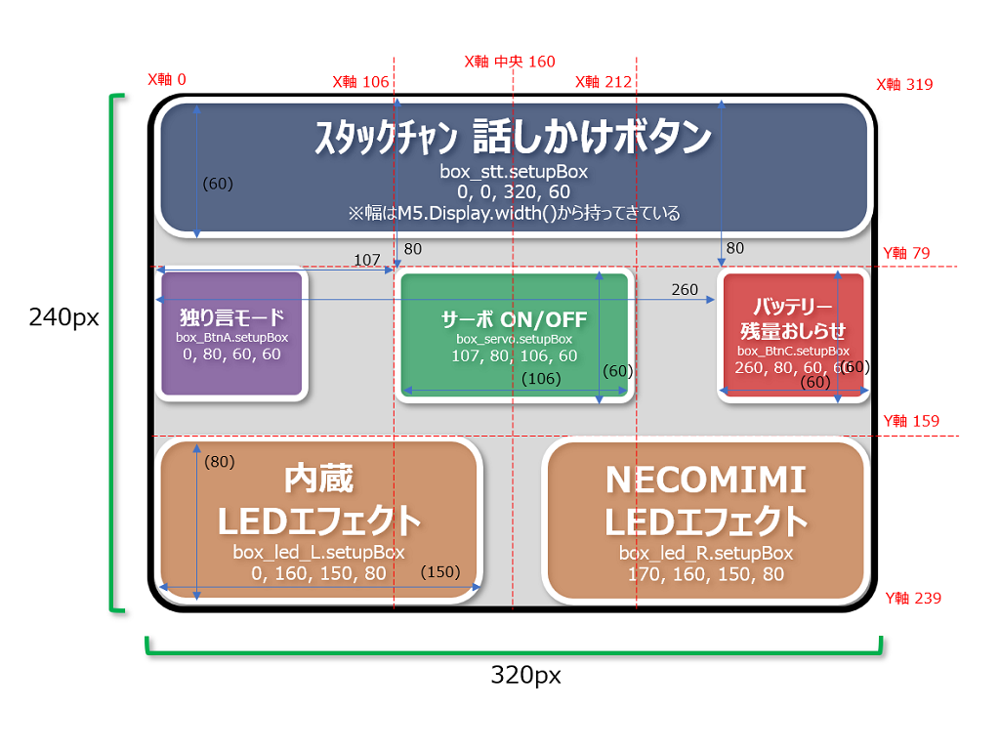
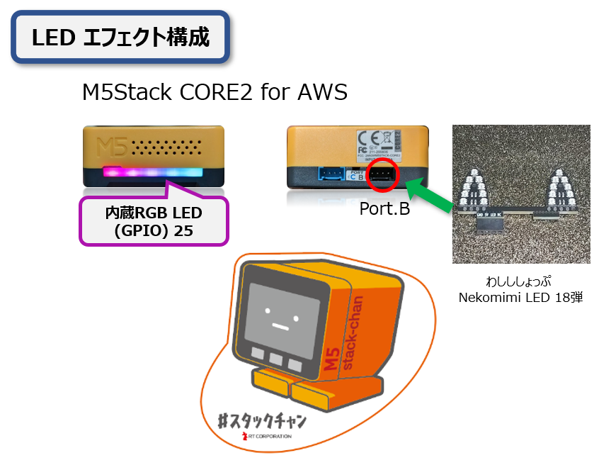

# AI_StackChan2 (LEDエフェクト実装版)

---
## 2024年8月16日:
画面中央のサーボ ON/OFF機能、中央左側の独り言モード、中央右側のバッテリー残量おしらせボタンの大きさと配置を修正しました。 

| 変更前のレイアウト              | 変更後のレイアウト              |
| ----------------------------- | ----------------------------- |
|  |  |

### エフェクト設定:
起動時:RAINBOW ⇒ COMET ⇒ LARSON ⇒ CHASE ⇒ STATIC ⇒ STOROBE ⇒ SINEWAVE ⇒ RANDOM ⇒ FADEINOUT ⇒ NANAIRO ⇒ MERAMERA ⇒ NONE(一旦停止) ⇒ RAINBOW…  
今回は、2ヶ所同時にLEDエフェクトを実施する際、AIｽﾀｯｸﾁｬﾝのChatGPT問い合わせで非常にメモリを使用するため、比較的軽い処理のものを並べています。

### ｽﾀｯｸﾁｬﾝの構成:
スイッチサイエンス等で販売しているM5Stack純正部品 RGB LED STRIP (100cm/60LED) SK6812を用いて動作確認をしています。 
 

### 使い方 ###
* こちらは[robo8080](https://twitter.com/robo8080)さんの【AIｽﾀｯｸﾁｬﾝ2】のソースコードにFastLEDライブラリを用いたLEDエフェクトを実装したものとなります。 
* このソースを用いてVSCode＋PlatformIO環境でビルドすると、M5Stack Core2 for AWS、またはM5Stack Core2にM5GoBottom2を追加し、LEDエフェクトを直ぐに確認することができます。 
  (変更は下記並びに[main.cpp](https://github.com/ToshihiroMakuuchi/AI_StackChan2/blob/ToshihiroMakuuchi/LED_Effects/M5Unified_AI_StackChan/src/main.cpp)ソース内コメントをご確認ください)<>br
* Core2 for AWSやM5GoBottom2のLEDバーの使用するデータピンは【25】が用いられ、またLED球は10個搭載されています。 
* 今回外部接続で確認したLEDは、[わしし](https://x.com/washishi)さんの[わしししょっぷ](https://washishi.booth.pm/)で販売している【Nekomimi LED】を用いました。(LED数:18弾) 
* ソースコードでは#defineにてLEDの有効/無効を設けていますので、必要な方は調整してビルドをお願いします。 
* 画面左端の中央付近にタッチすると【独り言モード】に切り替えられます。 
* 画面中央にタッチすると首振りを止めます。 
* 画面右端の中央付近にタッチするとバッテリーの残量をおしらせします。  

robo8080さんが公開している現時点のソースは下記となります。 
<https://github.com/robo8080/AI_StackChan2>  

## LEDエフェクト名称および有効パラメータ (11種)
| Name | Range | AoE | Delay | Color | Looping | Direction | Description |
| ----: | :-----: | :-----: |  :---: | :-----: | :-------: | :---------: | :--- |
| [RAINBOWWAVE](https://youtube.com/shorts/pfN8k_zY_gs?feature=share) | Y | N | Y | N | N | Y | 動的レインボーグラデーションエフェクト |
| [COMET](https://youtube.com/shorts/wfuuhPH90M0?feature=share) | Y | Y | Y | Y | Y | Y | LED光が尾をを引き設定範囲内を移動する流れ星エフェクト |
| [LARSON](https://youtube.com/shorts/xl6u4YCUk-E?feature=share) | Y | Y | Y | Y | Y | Y | LED光が設定範囲内を往復するエフェクト(ナイトライダー風) |
| [CHASE](https://youtube.com/shorts/lTgBS9gDuDU?feature=share) | Y | ? | Y | Y | N | Y | LEDを1つおきに交互に点滅させるエフェクト(工事現場風) |
| [STATIC](https://youtube.com/shorts/SkdqZ1L5pXA?feature=share) | Y | N | Y | Y | N | N | 同色がチラチラと点滅するキラキラ系エフェクト |
| [STOROBE](https://youtube.com/shorts/o3IekoJ9uqQ?feature=share) | Y | N | Y | Y | N | N | 設定範囲内でのストロボエフェクト(定期的に全LEDピカピカ) |
| [SINEWAVE](https://youtube.com/shorts/jg9CFqpYKt8?feature=share) | Y | N | Y | Y | N | Y | 設定範囲内のLED数だけ消灯しながら流れるエフェクト(COMETの逆イメージ) |
| [RANDOM](https://youtube.com/shorts/UXPfDr1h17c?feature=share) | Y | N | Y | N | N | N | LED全部がランダムに点灯するパレード(パリピ)エフェクト |
| [FADEINOUT](https://youtube.com/shorts/7j3RzVZ8V8k?feature=share) | N | N | N | Y | N | Y | LEDがフェードインアウトするエフェクト (色固定) |
| [NANAIRO](https://youtube.com/shorts/aiBonRR6LJo?feature=share) | N | N | N | N | N | Y | LEDがフェードインアウトするエフェクト(七色順番に点灯) |
| [MERAMERA](https://youtube.com/shorts/TvK8jyE4r2A?feature=share) | N | N | N | N | N | N | メラメラと燃えるようなエフェクト |
| NONE | N | N | N | N | N | N | エフェクトの停止 |

# 概要

[robo8080](https://twitter.com/robo8080)が開発された【AIｽﾀｯｸﾁｬﾝ2】に、FastLEDライブラリ＋NeoPixelEffectsライブラリを搭載し、簡単にLEDエフェクト機能を確認できるようにしたものです。

# 開発環境
- VSCode
- PlatformIO

# 対応機種

- M5Stack Core2 / Core2 for AWS
※他モデルはrobo8080さんも未対応となります。

# 必要なライブラリ

詳しいバージョンについては[platformio.ini](https://github.com/ToshihiroMakuuchi/AI_StackChan2/blob/ToshihiroMakuuchi/LED_Effects/M5Unified_AI_StackChan/platformio.ini)をご覧ください。

- [M5Unified](https://github.com/m5stack/M5Unified)

- [ESP8266Audio](https://github.com/earlephilhower/ESP8266Audio)

- [M5Stack-Avatar](https://github.com/meganetaaan/m5stack-avatar)

- [ServoEasing](https://github.com/ArminJo/ServoEasing)

- [ESP32Servo](https://github.com/madhephaestus/ESP32Servo)

- [ArduinoJson](https://github.com/bblanchon/ArduinoJson)

- [ESP32WebServer](https://github.com/Pedroalbuquerque/ESP32WebServer/blob/master/src/ESP32WebServer.h)

- [SimpleVox](https://github.com/MechaUma/SimpleVox)

- [ESPmDNS](https://github.com/espressif/arduino-esp32/blob/master/libraries/ESPmDNS/src/ESPmDNS.h)

- [FastLED](https://github.com/FastLED/FastLED)

- [NeoPixelEffects](https://github.com/nolanmoore/NeoPixelEffects) 
NeoPixelEffectsに関してのcppファイル、hファイルは直接src以下に保存します。

# ビルド(コンパイル)時の注意

- ~~特にPlatformIOのバージョンだけ注意すれば、問題なく利用可能かと思います。~~

- ~~いくつかの警告表示に対応しました。(2024/08/16)~~

# 設定
SDカード等の設定方法は、こちらを参照してください。 
* [AI_StackChan2_README](https://github.com/robo8080/AI_StackChan2_README/ "Title") 
 

# Credit
- [meganetaaan](https://github.com/meganetaaan)
- [lovyan03](https://github.com/lovyan03/LovyanGFX)
- [tobozo](https://github.com/tobozo)
- [Takao Akaki](https://github.com/mongonta0716)
- [ToshihiroMakuuchi](https://github.com/ToshihiroMakuuchi)

# LICENSE
[MIT](LICENSE)

# Author
[robo8080](https://github.com/robo8080)

---

AIｽﾀｯｸﾁｬﾝ2です。
  

  

AIｽﾀｯｸﾁｬﾝ2の特徴 

* 音声合成にWeb版 VOICEVOXを使います。
* 音声認識に"Google Cloud STT"か"OpenAI Whisper"のどちらかを選択できます。
 

Google Cloud STTは、”MhageGH”さんの [esp32_CloudSpeech](https://github.com/MhageGH/esp32_CloudSpeech/ "Title") を参考にさせて頂きました。ありがとうございました。 
"OpenAI Whisper"が使えるようにするにあたって、多大なご助言を頂いた”イナバ”さん、”kobatan”さんに感謝致します。 
ウェイクワードには、”MechaUma”さんの[SimpleVox](https://github.com/MechaUma/SimpleVox/ "Title")ライブラリを使わせていただきました。

---

### M5GoBottom版ｽﾀｯｸﾁｬﾝ本体を作るのに必要な物、及び作り方 ###
こちらを参照してください。 
* [ｽﾀｯｸﾁｬﾝ M5GoBottom版組み立てキット](https://raspberrypi.mongonta.com/about-products-stackchan-m5gobottom-version/ "Title") 

### プログラムをビルドするのに必要な物 ###
* [M5Stack Core2](http://www.m5stack.com/ "Title") 
* VSCode 
* PlatformIO 

使用しているライブラリ等は"platformio.ini"を参照してください。 

~~【5/31の時点ではM5Unifiedの不具合の為、CoreS3では動きません。】~~ 

---

### サーボモーターを使用するGPIO番号の設定 ###
* main.cppの46行目付近、サーボモーターを使用するGPIO番号を設定してください。

### 使い方 ###

こちらを参照してください。 

* [AI_StackChan2_README](https://github.com/robo8080/AI_StackChan2_README/ "Title") 
 
 
 
